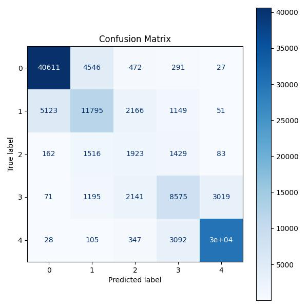
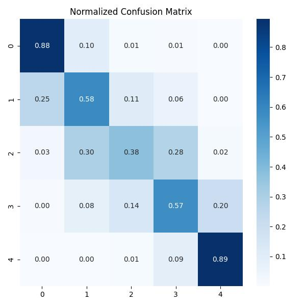
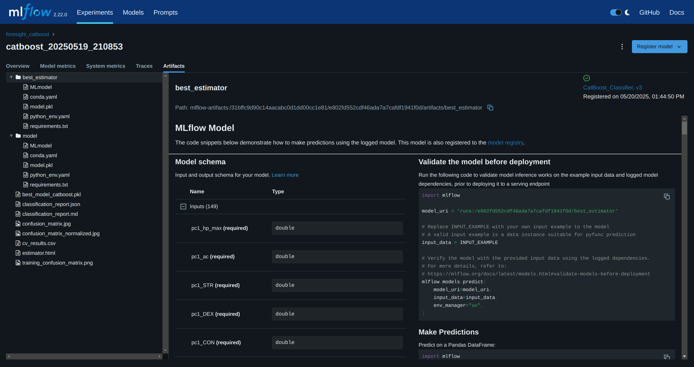

# Foresight: Predicting Encounter Difficulty in Dungeons & Dragons


<a href="https://cookiecutter-data-science.drivendata.org/" target="_blank">
    
</a>
<a href="https://github.com/MaAnCoSa/Foresight" target="_blank">
    
</a>
<a href="https://github.com/MaAnCoSa/Foresight/tree/main/notebooks" target="_blank">
    
</a>


Foresight is a machine learning project that estimates the difficulty of potential combat encounters in Dungeons & Dragons 5th Edition. By analyzing the composition of player parties and enemy groups, it provides Dungeon Masters with a tool to plan balanced and engaging encounters.

This project was born out of a shared passion for programming and tabletop role-playing games. We combined both worlds to create something fun, technically challenging, and useful for the D&D community.

## Purpose and Motivation

In Dungeons & Dragons, designing balanced encounters is a recurring challenge for Dungeon Masters. Deciding how difficult a combat will be—based on party composition, monster stats, and other factors—often relies on intuition or time-consuming manual calculations. This can lead to unbalanced experiences that are either too easy or overwhelming for the players.

Foresight was created to address this problem by offering a data-driven approach. It uses machine learning to predict the difficulty level of encounters based on structured features such as hit points, armor class, abilities, and more.

Our motivation was simple: we enjoy programming, and we love D&D. This project allowed us to combine both interests into something meaningful and fun for us as a team, and hopefully valuable for others in the tabletop gaming community.


## Installation and Usage

Follow these steps to install and run the Foresight project locally.

### 1. Clone the repository

```bash
git clone https://github.com/MaAnCoSa/Foresight.git
cd Foresight
```

### 2. Create and activate the virtual environment
Make sure you have Python **3.12.9** installed. You can manage multiple versions with pyenv or install it directly.


```bash
python3.12 -m venv foresight_env
source foresight_env/bin/activate
```

On Windows (PowerShell):

```bash
python -m venv foresight_env
.\foresight_env\Scripts\Activate.ps1
```

### 3. Upgrade pip and install dependencies
```bash
pip install --upgrade pip
pip install -r requirements.txt
```

### 4. Verify the installation
```bash
python -V       # Should output Python 3.12.9
which python    # Should point to foresight_env/bin/python
```

## Model Management

The `models/` directory contains serialized versions of trained models produced during experimentation, including variants using CatBoost, LightGBM, and XGBoost. However, the main model tracking and version control is handled remotely via [MLflow](https://dagshub.com/MaAnCoSa/Foresight.mlflow), hosted on DagsHub.

All training runs are logged automatically with:
- Model parameters and metrics (e.g., `f1_macro`, `accuracy`)
- Confusion matrices and classification reports
- Artifacts such as serialized `.pkl` models
- Full experiment metadata

### Model Registry

We use the **MLflow Model Registry** to manage production-ready models. The best-performing model according to our evaluation criteria is promoted to the **`Champion`** stage. This designation is updated manually or programmatically after performance review.

You can view and compare all registered models, including version history and transitions, at:

[Foresight Model Registry (DagsHub)](https://dagshub.com/MaAnCoSa/Foresight.mlflow/#/models)

### Example model workflow

- Train multiple models locally or remotely
- Log experiments automatically to MLflow
- Review metrics and artifacts in the UI
- Promote the best model to `Champion`
- Use the `Champion` version in downstream applications or deployments

## Contributing

We welcome contributions to Foresight from the community. Whether you're a Dungeons & Dragons enthusiast, a data scientist, or a developer, your input is valuable to help improve and extend this project.

### How to contribute

1. **Fork this repository** and clone your fork.
2. Create a new branch:
```bash
   git checkout -b feature/my-feature
```
3. Make your changes and commit them:

```bash
git commit -m "Add feature X"
```
4. Push to your fork:
```bush
git push origin feature/my-feature
```

5. Open a Pull Request from your branch to main.

### Reporting bugs and suggesting improvements
If you encounter any bugs or have suggestions for enhancements:

- Open an issue in the GitHub Issues section.

- Provide a clear description of the problem or suggestion.

- Include steps to reproduce (if reporting a bug).

- Tag the issue appropriately (e.g., bug, enhancement, question).

We review all issues and pull requests as promptly as possible.


## Examples

The following examples illustrate how Foresight analyzes combat scenarios and predicts encounter difficulty.

### Example 1: Confusion Matrix for the Champion Model

This matrix shows the performance of the current `Champion` model on the test set.



---

### Example 2: Normalized Confusion Matrix

Useful for visualizing how the model distributes predictions across classes in imbalanced datasets.



---

### Example 3: MLflow Run Artifacts

All experiment results, including metrics, classification reports, and model artifacts, are logged automatically to [DagsHub MLflow](https://dagshub.com/MaAnCoSa/Foresight.mlflow).



---

### Example 4: Jupyter Notebook Exploration

We use Jupyter notebooks to perform exploratory data analysis and feature engineering.


## Project Organization

```
├── LICENSE            <- Open-source license if one is chosen
├── Makefile           <- Makefile with convenience commands like `make data` or `make train`
├── README.md          <- The top-level README for developers using this project.
├── data
│   ├── external       <- Data from third party sources.
│   ├── interim        <- Intermediate data that has been transformed.
│   ├── processed      <- The final, canonical data sets for modeling.
│   └── raw            <- The original, immutable data dump.
│
├── docs               <- A default mkdocs project; see www.mkdocs.org for details
│
├── models             <- Trained and serialized models, model predictions, or model summaries
│
├── notebooks          <- Jupyter notebooks. Naming convention is a number (for ordering),
│                         the creator's initials, and a short `-` delimited description, e.g.
│                         `1.0-jqp-initial-data-exploration`.
│
├── pyproject.toml     <- Project configuration file with package metadata for 
│                         foresight and configuration for tools like black
│
├── references         <- Data dictionaries, manuals, and all other explanatory materials.
│
├── reports            <- Generated analysis as HTML, PDF, LaTeX, etc.
│   └── figures        <- Generated graphics and figures to be used in reporting
│
├── requirements.txt   <- The requirements file for reproducing the analysis environment, e.g.
│                         generated with `pip freeze > requirements.txt`
│
├── setup.cfg          <- Configuration file for flake8
│
└── foresight   <- Source code for use in this project.
    │
    ├── __init__.py             <- Makes foresight a Python module
    │
    ├── config.py               <- Store useful variables and configuration
    │
    ├── dataset.py              <- Scripts to download or generate data
    │
    ├── features.py             <- Code to create features for modeling
    │
    ├── modeling                
    │   ├── __init__.py 
    │   ├── predict.py          <- Code to run model inference with trained models          
    │   └── train.py            <- Code to train models
    │
    └── plots.py                <- Code to create visualizations
```

--------

## Environment Setup (Python 3.12.9)

To set up the development environment for this project, follow these steps:

### 1. Clone the repository

```bash
git clone https://github.com/MaAnCoSa/Foresight.git
cd Foresight
```

## 2. Create and activate the virtual environment
Make sure you have Python **3.12.9** installed. You can manage multiple versions with pyenv or install it directly.

```bash
python3.12 -m venv foresight_env
source foresight_env/bin/activate
```

On Windows (PowerShell):

```bash
python -m venv foresight_env
.\foresight_env\Scripts\Activate.ps1
```

## 3. Upgrade pip and install dependencies
```bash
pip install --upgrade pip
pip install -r requirements.txt
```

## 4. Verify the installation
```bash
python -V       # Should output Python 3.12.9
which python    # Should point to foresight_env/bin/python
```